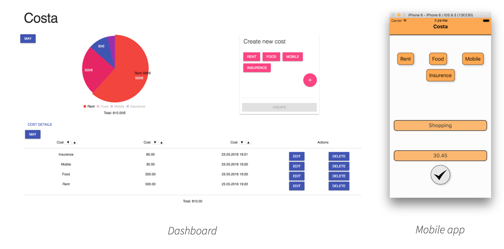

# costa
Keep track of your daily costs across all devices.

## Prerequisites
-   [Node.js](<https://nodejs.org/en/download/current/>) 6.X
-   For mobile applications see [React Native Docs](<https://facebook.github.io/react-native/docs/getting-started.html>)

## Commands

[npm scripts](<https://docs.npmjs.com/misc/scripts>) can be started from the command line with \`npm run <command>\`

| Command | Description                                      |
|-------- |------------------------------------------------- |
| start   | Start the webapp in production mode on port 3000 |
| develop | Start the webapp with [hmr]() on port 4000       |
| test    | Run test suite                                   |
| deploy  | Deploy to RaspberryPi                            |
